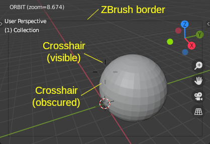
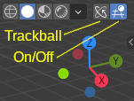
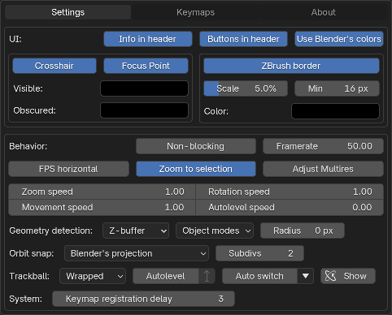
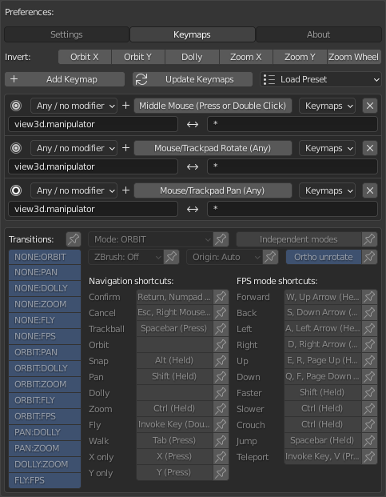
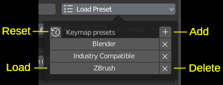
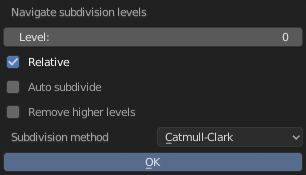

# Mouselook Navigation

* [Overview](#overview)
  * [Features](#features)
  * [3D Viewport](#3d-viewport)
  * [3D Viewport header](#3d-viewport-header)
* [Settings](#settings)
  * [UI](#ui-section)
  * [Behavior](#behavior-section)
* [Keymaps](#keymaps)
  * [Common options](#common-options)
  * [Keymap management](#keymap-management)
  * [List of keymap configurations](#list-of-keymap-configurations)
  * [Keymap-specific options](#keymap-specific-options)
* [Extras](#extras)
  * [Subdivision level navigation](#subdivision-level-navigation)
* [Known issues](#known-issues)

## Overview

The addon attempts to provide better usability and customization of basic 3D viewport navigation (in particular, ZBrush mode and FPS-like movement). It's an alternative to Blender's default orbit/pan/zoom/dolly/fly/walk navigation.

### Features

* ZBrush mode - mostly useful for tablet users, since it allows to use the same mouse button both for painting/sculpting and for navigation (depending on whether you clicked on geometry or on background)
* Easy switching between navigation modes without exiting the operator
* Changes to viewport can be cancelled from any mode
* FPS-like movement is available in all navigation modes
* Crosshair can be visible in all modes and has a different look when obscured
* Option to more easily prevent accidental viewport rotation in Ortho projection
* Option to auto-level the view when it's tilted
* Different turntable/trackball algorithms and different fly mode (more FPS-like)
* Subdivision level navigation operator

### 3D Viewport

* **Crosshair** - indicates the point around which the view rotates, and/or the focus point of the viewport
* **ZBrush border** - indicates the rectangle inside which ZBrush behavior is active (outside of the rectangle, navigation will happen regardless of the presence of geometry under the mouse)

### 3D Viewport header

* **Trackball** toggle - toggles between Trackball and Turntable orbit methods (chages Blender's "Orbit Method" preference)
* **On/Off** toggle - enables/disables Mouselook Navigation, without disabling the addon itself (this setting is saved in the .blend file, instead of addon preferences)
  * *Note: if you want this option to be off by default, it can be achieved by saving Blender's startup file with this toggle in the 'off' state*

## Settings

### **UI** section
* **Info in header** - whether to display mode and zoom info in 3D Viewport's header during the navigation
* **Buttons in header** - whether to display Mouselook Navigation buttons in 3D Viewport's header
* **Use Blender's colors** - if enabled, Blender's *3D Viewport\View Overlay* theme color is used for crosshair and for ZBrush border
* **Crosshair** - whether to display the crosshair
  * **Focus Point** - whether to display the viewport's focus point (when it's not the same as the current orbit point)
  * **Visible** - color for the visible parts of the crosshair
  * **Obscured** - color for the obscured parts of the crosshair
* **ZBrush border** - whether to display ZBrush border
  * **Scale** - relative size of the border (percentage of viewport size)
  * **Min** - absolute size of the border (in pixels)
  * **Color** - color of the border

### **Behavior** section
* **Non-blocking** - if enabled, navigation will not block execution of other operators
* **Framerate** - update rate during the navigation (in frames per second)
* **FPS horizontal** - if enabled, FPS forward/backward moves in horizontal plane, and up/down moves in the world's vertical direction
* **Zoom to selection** - if both this and Blender's *Rotate Around Selection* preference are enabled, Mouselook Navigation will zoom to the center of selection
* **Adjust Multires** - if this and the *Fast Navigate* option (in Blender's *Sculpt* menu) are enabled, the sculpt resolution of Multires modifier will be set to 1 during the navigation in Sculpt mode (*WARNING: for high-detail meshes, this will cause lag / delays when starting or ending the navigation*)
* **Zoom speed** - speed multiplier for zooming.
* **Rotation speed** - speed multiplier for rotation.
* **Movement speed** - speed multiplier for FPS movement.
* **Autolevel speed** - the speed of autolevelling
* **Geometry detection** (affects the addon's behavior in ZBrush mode and/or when Blender's *Auto Depth* preference is enabled)
  * **Geometry detection method** - how to detect the geometry under the mouse
    * *Disabled* - no geometry detection (in ZBrush mode, ignores navigation attempts in the central area of viewport)
    * *Raycast* - uses raycasting; can detect only mesh objects (*WARNING: causes problems in Sculpt mode*)
    * *Selection* - uses Blender's selection operator (*WARNING: causes problems in Sculpt mode*)
    * *Z-buffer* - renders the viewport to a depth buffer
  * **Object modes** - in which object modes geometry detection should be used
  * **Radius** - distance (in pixels) to the nearest geometry, above which ZBrush navigation is allowed
* **Orbit snap** (options for angle snapping during orbiting)
  * **Projection** - if Blender's *Auto Perspective* preference is enabled, orbit snapping would switch the view to Orthographic or Perspective mode
    * *Don't change projection* - stay in the original projection mode
    * *Blender's projection* - use Blender's default Auto Perspective behavior
    * *ON: Ortho, OFF: Perspective* - switch to Orthographic when snapping, and to Perspective otherwise
    * *ON: Ortho, OFF: Original* - switch to Orthographic when snapping, and to the initial projection mode otherwise
  * **Subdivs** - number of intermediate angles to which the view rotation can be snapped (1 snaps to each 90 degrees, 2 snaps to each 45 degrees, and so on)
* **Trackball** (options related to Trackball mode)
  * **Trackball mode** - which trackball algorithm to use
    * *Center* - rotation depends only on mouse speed and not on mouse position
    * *Wrapped* - like Center, but rotation depends on mouse position
    * *Blender* - attempts to emulate Blender's trackball behavior (though does not behave exactly the same)
  * **Autolevel** - enables or disables autolevelling in the trackball mode
    * **Up** - if enabled, autolevelling would always try to orient view's up axis to world's up axis in trackball mode
  * **Auto switch** - enables or disables automatic switching between Trackball and Turntable in certain object modes
    * **Auto Trackball modes** dropdown - in which object modes to auto-switch to Trackball
  * **Show** - if enabled, the Trackball toggle in 3D Viewport's header will be shown
* **System** (options related to the inner workings of the addon)
  * **Keymap registration delay** - The number of frames (after script reload) to wait before the addon  registers its keymaps. The delay is necessary to avoid crashes, and in the presence of some other addons may need to be more than 1 frame.

## Keymaps

Here you can customize the keymaps / shortcuts used for invoking the navigation operator, and its behavior. These keymaps are automatically registered on addon initialization.

### Common options
  * **Invert** - which directions/axes should be inverted

### Keymap management
  * **Add Keymap** - adds a new keymap configuration to the list (note: this does not automatically update Blender's keymaps)
  * **Update keymaps** - updates Blender's keymaps according to the list of keymap configurations
  * **Load Preset** - a popup panel for loading and managing keymap presets
    * 
    * ***Reset*** - resets the list of presets
    * ***Add*** - saves the current setup to a new preset
    * ***Load*** - loads the specified preset (and updates Blender's keymaps)
    * ***Delete*** - deletes the specified preset
    * Presets can also be ***imported*** from and ***exported*** to the file system (the corresponding options are located in the context menu - simply right-click on any button in the Keymap presets panel)
      * If you didn't right-click on a specific preset, then the "Export" option will export the current setup

### List of keymap configurations
Each of the keymap configurations has the following elements:
* [**⊙**](a "Round button") - (un)selects the corresponding keymap
* **Modifiers** - which modifier(s) (Shift, Ctrl, Alt...) to use for this shortcut
* **Keys (events)** - key(s) and event(s) that should trigger the keymap's operator (a separate keymap will be registered for each combination)
* **Keymaps** - in which of the Blender's keymap categories the shortcuts should be registered (note: only those relevant to 3D viewport navigation are listed here)
* **X** - deletes the corresponding keymap configuration
* **Preceding operators** (left) - which operators need to have higher priority than this keymap's operator (asterisk * means all operators)
* **Succeeding operators** (right) - which operators need to have lower priority than this keymap's operator (asterisk * means all operators)

### Keymap-specific options
This section shows options for the selected keymap configuration (or the default options, if no keymap is selected). Each keymap-specific option has an **Override** toggle ([📌](a "Pin icon")), which allows to override the default value.
* **Transitions** - allowed transitions between modes
* **Mode** - keymap's default mode
* **Independent modes** - if enabled, each navigation mode will use its own position/rotation/zoom
* **ZBrush** - what type of ZBrush behavior (if any) to use for this keymap
  * *Off* - don't use ZBrush behavior
  * *Simple* - use ZBrush behavior only when no modifier keys are pressed
  * *Always* - always use ZBrush behavior
* **Origin** - what should be used as the orbit origin
  * *Auto* - determine orbit origin from Blender's preferences
  * *View* - use 3D viewport's focus point
  * *Mouse* - orbit around the point under the mouse
  * *Last Mouse* - orbit around the point under the last mouse click (works only in ZBrush mode)
  * *Selection* - orbit around the selection pivot
* **Ortho unrotate** - if enabled and view projection is Orthographic, switching from Orbit to Pan/Dolly/Zoom will snap view rotation to its initial value and will disable switching to Orbit until the operator has finished
* ***Navigation shortcuts*** (keys used during the navigation)
  * **Confirm** - finish the navigation
  * **Cancel** - finish the navigation and return the viewport to how it was
  * **Trackball** - switch between Turntable and Trackball orbit methods
  * **Orbit** - switch to Orbit mode
  * **Snap** - toggle rotation snapping
  * **Pan** - switch to Pan mode
  * **Dolly** - switch to Dolly mode
  * **Zoom** - switch to Zoom mode
  * **Fly** - switch to Fly mode
  * **Walk** - switch to Walk mode
  * **X only** - use only X-axis input
  * **Y only** - use only Y-axis input
* ***FPS mode shortcuts*** (keys used for FPS-like navigation)
  * **Forward** - move forward
  * **Back** - move backward
  * **Left** - move left
  * **Right** - move right
  * **Up** - move upward (automatically switches off gravity)
  * **Down** - move downward (automatically switches off gravity)
  * **Faster** - use fast speed
  * **Slower** - use slow speed
  * **Crouch** - "crouch" in Walk mode (when gravity is on)
  * **Jump** - "jump"/"jetpack" in Walk mode (automatically switches on gravity)
  * **Teleport** - "teleport"/"grappling hook" in Walk mode

## Extras

### Subdivision level navigation

This is an operator for "navigating" between subdivision levels of *Multires / Subsurf / Subdivide* modifiers on selected objects (Blender has a similar operator called "Subdivision Set", but with fewer options). If you want to [make a shortcut](https://docs.blender.org/manual/en/latest/editors/preferences/keymap.html) for it, use the *mouselook_navigation.subdivision_navigate* operator identifier.

Warning: if you use Blender versions earlier than 2.93, you may encounter problems when trying to undo the effects of this operator in Sculpt mode.

* *Level* - the target subdivision level (if *Relative* is off) or subdivision level offset (if *Relative* is on)
* *Relative* - whether to set a specific subdivision level or to increment/decrement it
* *Auto subdivide* - automatically subdivide when necessary; also adds a subdivision modifier if the object has none (*Multiresolution* for Mesh objects in Sculpt mode, *Subdivide* for Grease Pencil objects, *Subdivision Surface* in other cases)
* *Remove higher levels* - if level is decremented, remove all higher levels
* *Subdivision method* - which method to use for subdividing
* *Show dialog* (keymap-only option) - whether to show the dialog with options or to execute the operator immediately

## Known issues

* The "Blender" trackball mode doesn't actually behave like in Blender
* Blender's *Rotate Around Selection* behavior is not exactly replicated in scuplt/paint modes and when editing text-curves
* Zooming/rotation around the last paint/sculpt stroke position is not supported
* Panning is not possible when view is locked to 3D cursor (Blender does not provide a way to control this offset)
